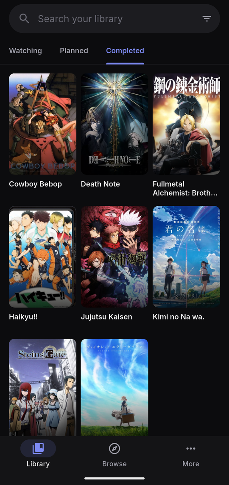
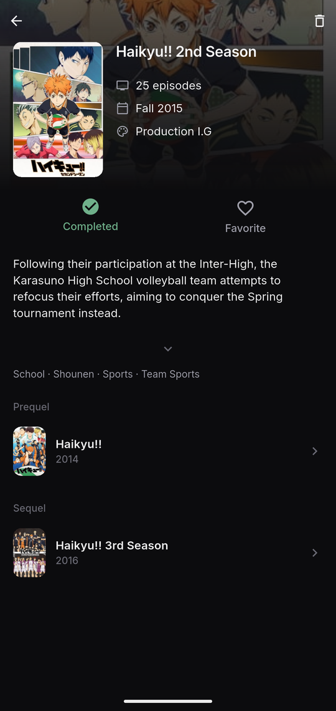
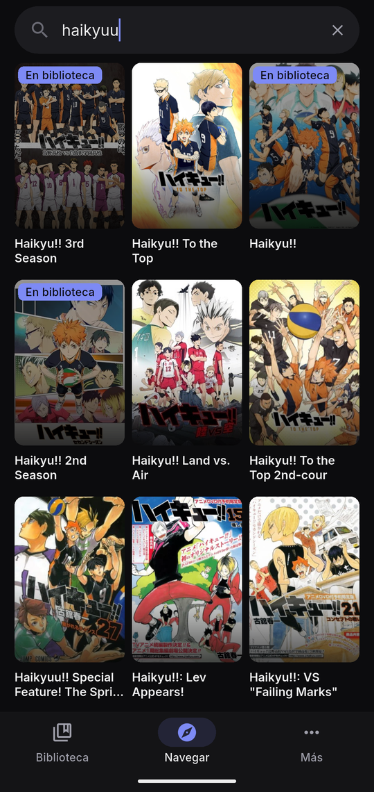
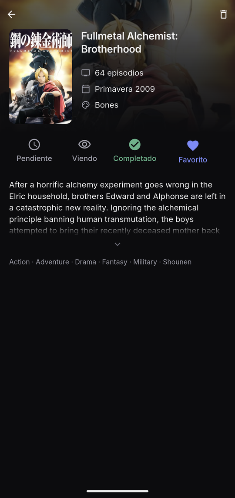

<p align="center">
  
</p>

<h1 align="center">AniHub</h1>

<p align="center">A minimal anime tracker for Android.</p>

<p align="center">
  <a href="https://github.com/AlvaroMunozS/AniHub/actions/workflows/ci.yml"></a>
  <a href="https://github.com/AlvaroMunozS/AniHub/releases/latest"></a>
  <a href="LICENSE"></a>
</p>

<p align="center">
  
  
  
  
</p>

AniHub keeps track of the anime you are watching, plan to watch and have
completed. There is no account and no server: the library is stored on the
device.

The app is currently available in Spanish only.

## Features

- Three lists: *Watching*, *Planned* and *Completed*.
- Favorites, with their own filter in the Completed list.
- Seasons of the same franchise grouped into one expandable poster.
- Library search, filtering and sorting.
- Anime details with synopsis, genres, studio, season, prequel and sequel.
- Catalog search powered by [MyAnimeList](https://myanimelist.net).
- The library works offline, and cover images are cached on the device.
- Library import from an `anihub-library` JSON file
  ([format](docs/DEVELOPMENT.md#import-format)).

AniHub deliberately has no scores, reviews, episode counters or statistics.
See the [project scope](CONTRIBUTING.md#scope).

## Download

Read the [privacy policy](PRIVACY.md) before installing, then download the APK
from the [latest release](https://github.com/AlvaroMunozS/AniHub/releases/latest).
New versions install over the previous one and keep the library.
Requires Android 7.0 or later.

AniHub has no backup or export of its own. If Android backup is enabled on
the device, the library is included in it and restored when the app is
reinstalled; otherwise uninstalling the app deletes it.

## Verifying the APK

Each release lists the SHA-256 of the APK and of its signing certificate. The
signing certificate is always:

```
e667fdf95c20d91007e91ae41524af4677aa0ffcdcb69a9ba28c9fbe57524500
```

```bash
sha256sum -c anihub-vX.Y.Z.apk.sha256
apksigner verify --print-certs anihub-vX.Y.Z.apk
gh attestation verify anihub-vX.Y.Z.apk --repo AlvaroMunozS/AniHub
```

The last command checks that the APK was built by this repository's release
workflow.

## Privacy

AniHub has no account, analytics or ads and only connects to MyAnimeList. See
the [privacy policy](PRIVACY.md).

## Building from source

See [docs/DEVELOPMENT.md](docs/DEVELOPMENT.md).

## Contributing

Bug reports and ideas are welcome as issues. See
[CONTRIBUTING.md](CONTRIBUTING.md).

## Credits

- Anime data and images from [MyAnimeList](https://myanimelist.net). AniHub is
  not affiliated with or endorsed by MyAnimeList.
- [Inter](https://rsms.me/inter/) typeface, under the
  [SIL Open Font License](assets/fonts/OFL.txt).

## License

[MIT](LICENSE)
